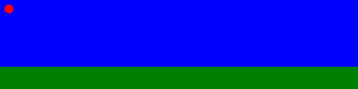

# 2D Image Workshop
## SVG Basics
Following the examples I made my own file with all the shapes neatly contained in it, with anotations in case I need to refresh my memory

The next step was to try and animate a ball

Wich proved to be more complex than I thought, but at least I learned about svg path values and took a sneak peek at Bezier curves   (even if i didn't end up using them for this animation). This website has a lot of useful information:
https://developer.mozilla.org/en-US/docs/Web/SVG/Attribute/d#cubic_b%C3%A9zier_curve

## InkScape Basics
### First steps
I first started toying around with the program and made this cool abstract thing by abusing the star generation tool.

### Drawing artsy stuff
After reading all the examples I was eager to try my hand at drawing something of my own accord.

What stuck out to me the most was using layers, as it was something new to me, but very quickly proved how useful they are.

### Drawing acording to specs
### Culmination of everything learned 