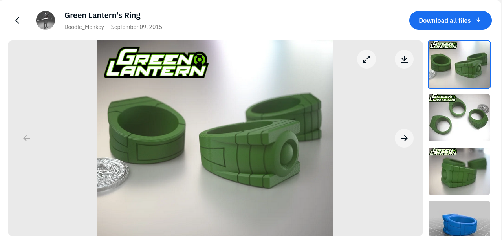
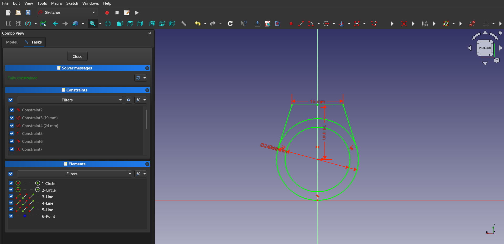
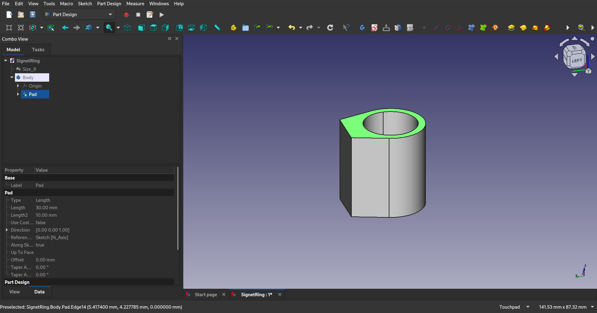
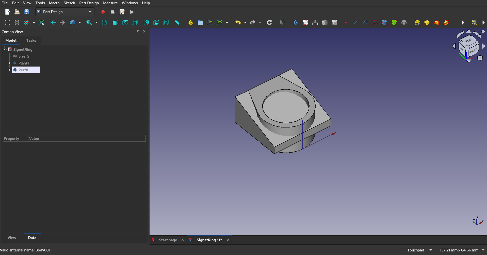
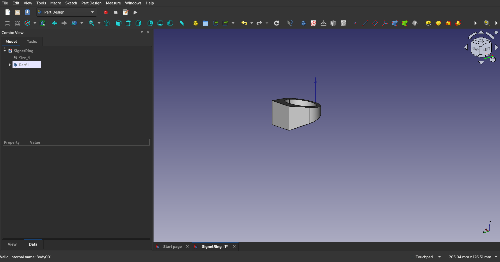
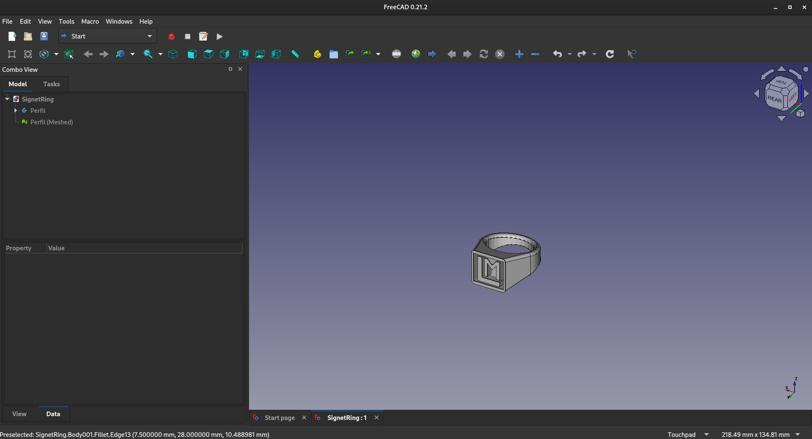

# 3D Design Workshop

## Signet ring proyect
While reading the proposed class excercises I got inspired by the ring excercises. But instead of doing a simple trinket, I decided to create a signet ring, wich is an item with more sentimental value to me.

I started by finding some references, and I chose this green larntern ring that had a cool outline and could be printed without needing supports.

The first step was to make a sketch of the ring's shape, by tracing the other ring. This part was were I had to learn a lot about how constraints work, as it was the most complex piece of the project.

Next, in a different plane I made the side profile of the ring, and extruded both sketches. Then using a bolean operation, deleted everything but the parts where both parts came together.

Lastly I designed a stamp with my initials, created a pad, and removed from the ring the material touching the pad. For the finishing touches I filleted all the edges except the ones in the stamp.

This is the finished product, printed in glow in the dark filament.

## 2D Extension cable holder
We then took the design plans made in the 2D image workshop, to make a shelf piece in 3d, and hopefully print it out.
First we make the side profile and extrude it.

[ADD IMAGE]

Then we make the hole part, and use a boolean substraction on the first model.

[ADD IMAGE]

We can now export to technichal drawing, much better than the one we made in Inkscape.

[ADD IMAGE]

## Robot parts
Our last task is to make a simple claw to test moving parts in FreeCAD.