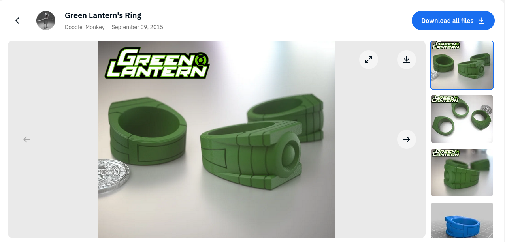
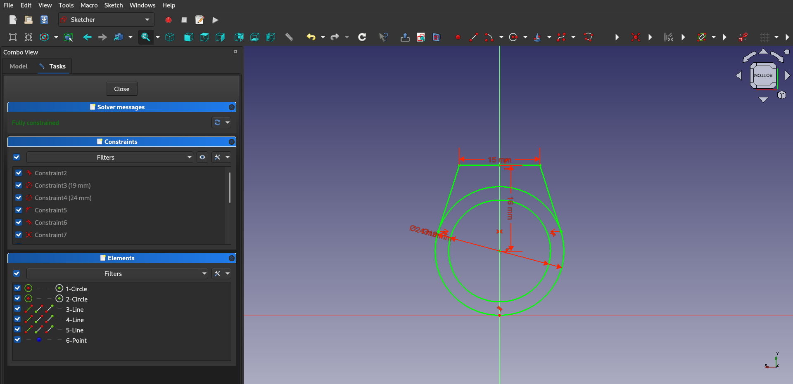
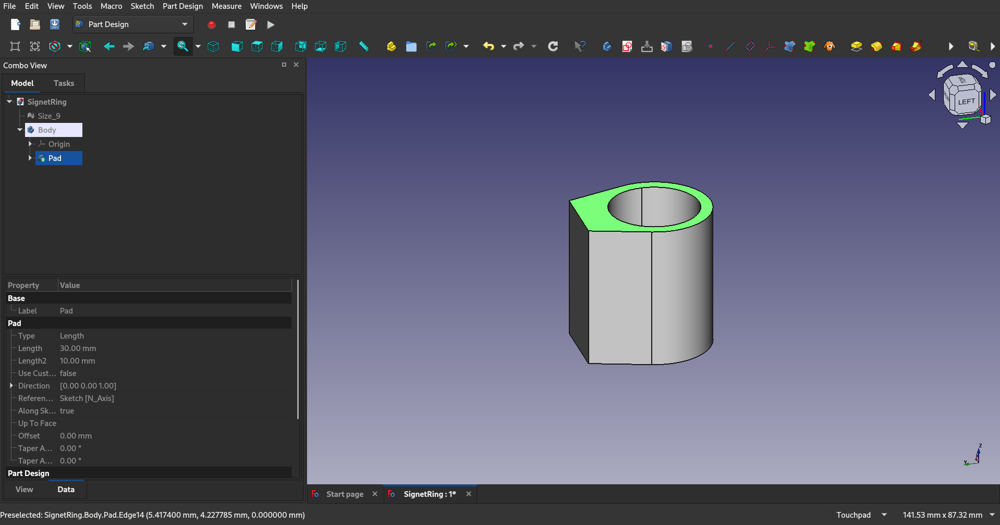
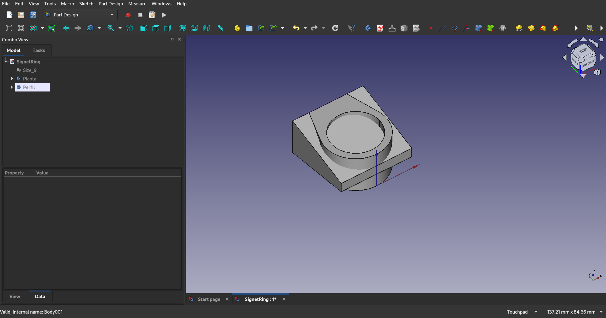
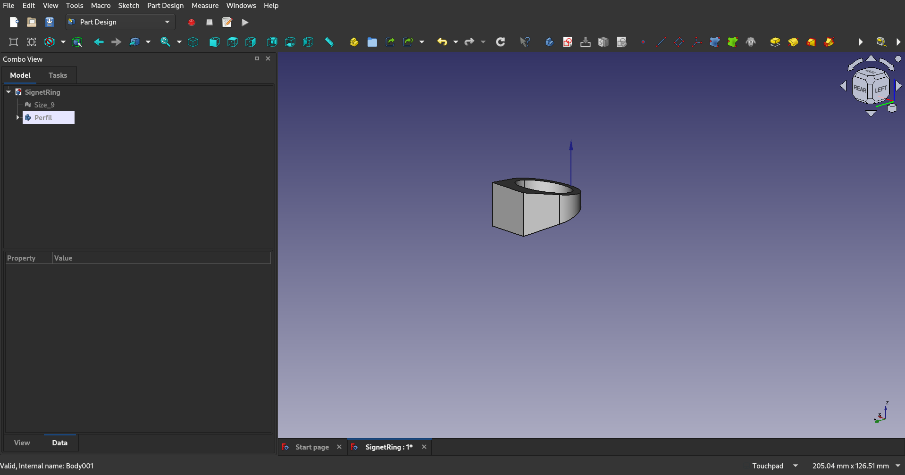
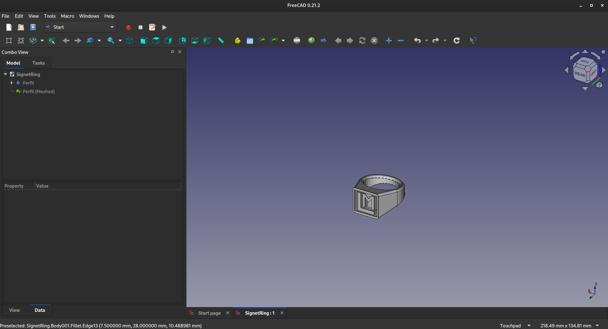
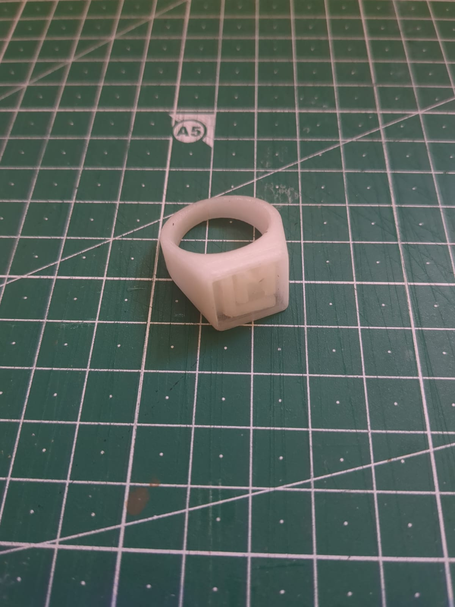
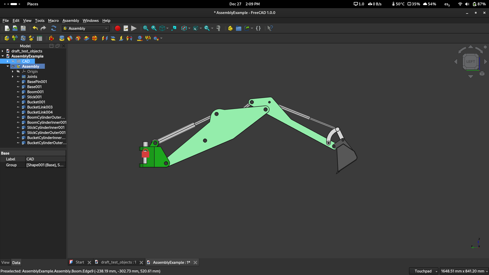
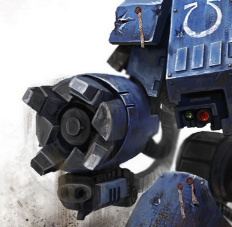
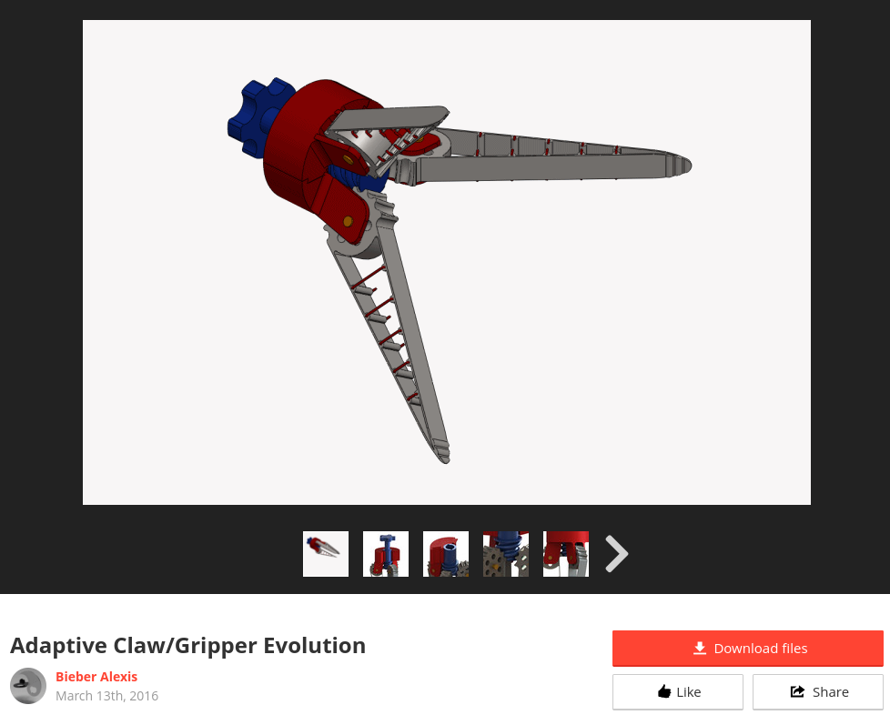

# 3D Design Workshop

## Signet ring proyect
While reading the proposed class excercises I got inspired by the ring excercises. But instead of doing a simple trinket, I decided to create a signet ring, wich is an item with more sentimental value to me.

I started by finding some references, and I chose this green larntern ring that had a cool outline and could be printed without needing supports.

The first step was to make a sketch of the ring's shape, by tracing the other ring. This part was were I had to learn a lot about how constraints work, as it was the most complex piece of the project.

Then, I made a pad of the design, making sure it was tall enough for the next steps

Next, in a different plane I made the side profile of the ring, and extruded both sketches.

Using a bolean operation,I then deleted everything but the area where both parts came together.

Lastly I designed a stamp with my initials, created a pad, and removed from the ring the material touching the pad. For the finishing touches I filleted all the edges except the ones in the stamp.

This is the finished product, printed in glow in the dark filament.

## Robot parts
Our last task is to make a simple claw to test moving parts in FreeCAD. A simple design will work for this proof of concept.

First I decided to learn a bit by testing one of the preset examples FreeCad gives you, the excavator arm and bucket. With this we can get a feel on how to use the workbench.

Next, I decided to get some inspiration for the claw. My idea was to try and recreate a hand for the dreadnought proyect [ADD LINK].

My initial idea was to simplify the design by using a single infinite screw to drive the 4 claws. Much like this design found online.

Unfortunately, this design has the incorrect number of fingers, and uses a proprietary file system that we can't use. But it proves the idea of the design works, even if we have to make it from scratch.

To speed up this process we will search if someone has already made pieces that we could use. We will try to find the correct gears and parts in this repo [ADD LINK]

